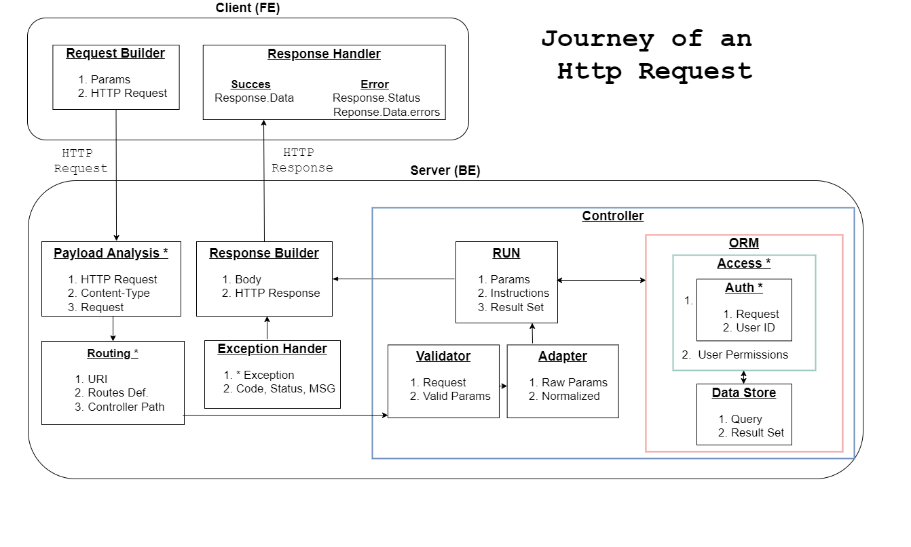

# HTTP native

eQual complies with HTTP standards by natively analyzing HTTP messages to route client requests to the appropriate controller.

A controller can announce which content-type must be used for the output. And in all situations, the output is sent to the STDOUT stream. For that reason, eQual can can seamlessly be used in both CLI or HTTP context.


The following schema summarizes the way HTTP requests are handled in order to generate a response.



## Controllers

Any invocation made to an eQual-driven server is handled as an HTTP request (even within a CLI context) and relayed to the appropriate controller which, in turn, produces an HTTP response.

Controllers are nothing more than regular PHP scripts.

Here is an example of a minimalist controller:

```php
<?php
echo "Hello World";
```
When invoked, this controller produces the following HTTP response :
```
HTTP/1.1 200 OK
Server: Apache/2.2.14
Content-Type: text/html
Connection: Closed
Content-Length: 11

Hello World
```


## Invoking controllers

Controllers are considered as **operations** that run specific sets of instructions based on parameters provided in the HTTP request.

For convenience, controllers can also be invoked in a CLI context, or directly within another PHP script.

Examples : 

| **PATH** | `demo\simple.php`                                        |
| ---------------- | ------------------------------------------------------- |
| **HTTP Request** | `GET http://equal.local/?get=demo_simple`               |
| **CLI**          | `$ ./equal.run --get=demo_simple`                       |
| **PHP Script**   | `eQual::run('get', 'demo_simple');` |

A controller invocation consists of two parts: 

* The first part tells what kind of operation must be performed:
    * `key` must be one of the following : 
        * **GET** some data (`/?get=...`)
        * **DO** something (`/?do=...`)
        * **SHOW** some formatted content (`/?show=...`)
    * `value` specifies the name of the **package** to be invoked (must be the name of a subfolder of the `packages` directory), as well as the **script** to be called(a package may have several scripts - stored in the subfolders `action`, `data`, or `apps`)
* The second part is either the body or a series of parameters


Here is an example of a controller invocation :  
``` 
http://equal.local/?get=model_collect&entity=core\Group
```

In this example, the main entry point (`index.php`) will run the script `packages/core/data/model/collect.php`.

### Unknown routes

If no controller matches the received request, a response with a `404 status` is returned.

Example:

http://equal.local/?do=foo
```JSON
HTTP/1.1 404 Not Found
Server: Apache/2.4.51
Content-Type: application/json
Connection: Keep-Alive
Content-Length: 96

{
    "errors": {
        "UNKNOWN_OBJECT": "Unknown ACTION_HANDLER (do) public:foo"
    }
}
```


## Default controller

The main config file (`config/config.json`) allows to define a default package and a default App to make the root entry-point redirect to a webapp.  


```json
{    
    [...],
    "DEFAULT_PACKAGE": "core",
    "DEFAULT_APP": "workbench",
    [...]
}
```

In this example, we define the root entry-point `http://equal.local/` will redirect to a `http://equal.local/index.php?show=core_workbench'`.

