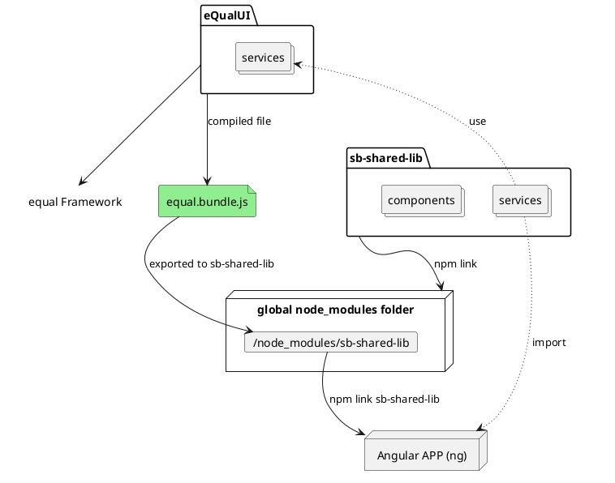

# How our frontend libraries work together

We have two main libraries that are used in our frontend applications: `eQualUI` and `sb-shared-lib` which is provided by [`symbiose-ui` repository](https://github.com/yesbabylon/symbiose-ui/tree/dev-2.0). 

