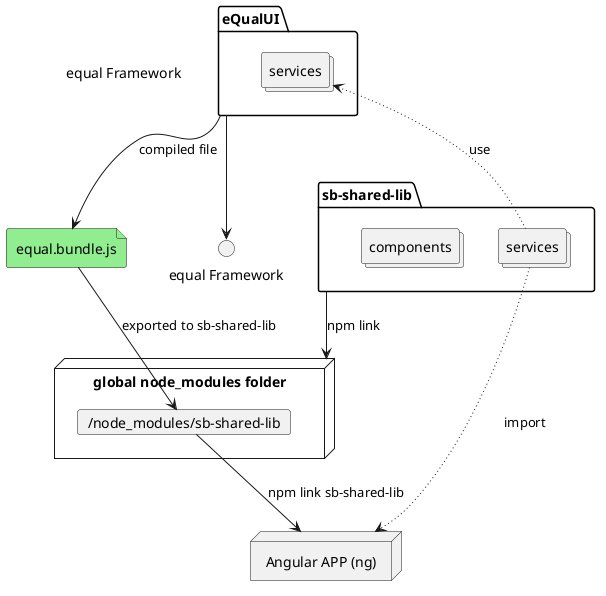

# Low Code : front-end

## Overview

### How frontend libraries work together

We have two main libraries that are used in our frontend applications: `eQualUI` and `sb-shared-lib` which is provided by [`symbiose-ui` repository](https://github.com/yesbabylon/symbiose-ui/tree/dev-2.0). 


<center></center>
<span>
<!--


-->
</span>

## eqUI  (eQual UI)


### STD App

The STD App allows to provide an empty app that can act as surrogate for basic app described in package manifest.

* app name
* menus
* default action
* specific acces (groups of users)


The STD app is part of the core package and, when initialized, is installed under `/public/app`.


The package manifest allows to provide a list of "apps" that can be either app ID (identifier of the app relating to a PATH), or a descriptor that provides information about a basic custom app that inherits (extends) from another.

```
{
    "name": "demo",
    "depends_on": [
        "core"
    ],
    "apps" : [
      {
	"id": "my_app",
	"name": "MyApp",
        "extends": "app",
        "description": "",
	"icon": "sentiment_satisfied",
        "color": "#29A1A1",
        "access": {
            "groups": [
                "users"
            ]
        },
        "params": {
            "menus": {
                "top": "app.left",
                "left": "app.top"
            }
        }
      }
    ]
}
```

!!! notes "Overriding apps"
    It is possible to override an App by using the same ID (will be put as-is in the `/public` folder: if the target forlder already exists, it is overwritten)


When a custom app extending another app is defined, the related URL is generated using the logic : `/app/#/:package/:app_id`


## Shared-lib

When developing custom application in a package of eQual, things can be tough. 

For example, it can be hard to know where is the eQual root URL or you may want to use the built-in view renderer of eQual UI.

To make things easier, you can use `sb-shared-lib` an Angular lib that allow you to access eQual the same way as a native eQual app.


### Compiling `shared-lib`

### Node version

To compile  `sb-shared-lib` you will need to use node 14.18.

If you need to install it aside of another node installation, you may use [Node Version Manager](https://github.com/nvm-sh/nvm) as follow :
```bash
nvm install 14.18
```
this allow your current directory to be bound to this specifically node version.

### Build SharedLib

Next, you'll need to clone symbioseUI and build it.

```
git clone https://github.com/yesbabylon/symbiose-ui.git
# you probably need to checkout to dev-2.0 to get newest version of symbioseUI
cd symbiose-ui
git checkout dev-2.0
git pull
npm install
cd sb-shared-lib
npm install
ng build
cd dist/sb-shared-lib
npm link 
```

Once you did this you only need to add equal.bundle.js to the library folder you linked

### eQUI (eQual UI)

Finaly, you can clone and build eQualUI

```
git clone https://github.com/equalframework/equal-ui.git
cd equal-ui
npm install
sh export.sh
```

### Using `shared-lib` in your app

#### Linking `sb-shared-lib` in the node_modules of your app

To use sb-shared-lib, you need to link the library to your project.

In the root of your project directory (regardless to your node version) :
```
npm link sb-shared-lib
```

#### Using `shared-lib` in Angular

When you need to use the library in a Angular module :
```ts
import { SharedLibModule } from 'sb-shared-lib';

@NgModule({
    declarations: [

    ],
    imports: [
        CommonModule,
        SharedLibModule,
    ],
    exports: [
    ],
    providers: [

    ],
})
export class MyAppModule { }
```

### Code Snippets

#### Creating custom API service using `ApiService`

```ts
import { ApiService } from 'sb-shared-lib';


@Injectable({
    providedIn: 'root'
})
export class CustomApiService {
    public cached_schema:any

    constructor(
        private api: ApiService,
    ) {  }
    
    /**
     * Sample function that checks consistency of pkg
     * 
     * @param pkg package to check
     * 
     * @return list of the message about the consistency of the package
     */
    public async getPackageConsistency(pkg:string):Promise<string[]> {
        var ret = []
        try {
            ret = await this.api.fetch('?do=test_package-consistency&package='+pkg);
        }
        catch (response: any) {
            // Create a snack with an error message depending on the context and the HttpError instance
            this.api.errorFeedback(e) 
        }
        return ret;
    }

}
```

#### Using `EnvService` to locate eQual endpoints

```ts
import { EnvService } from 'sb-shared-lib';

@Component({
    selector: 'app-controller-info',
    templateUrl: './controller-info.component.html',
    styleUrls: ['./controller-info.component.scss'],
    encapsulation : ViewEncapsulation.Emulated
})
export class ControllerInfoComponent implements OnInit {
    public backend_url:string = "";
    public rest_api_url:string = "";

    constructor(
        private env:EnvService
    ) { }

    async ngOnInit() {
        const env = (await this.env.getEnv())
        this.backend_url = env["backend_url"]
        this.rest_api_url = env["rest_api_url"]
    }
}
```